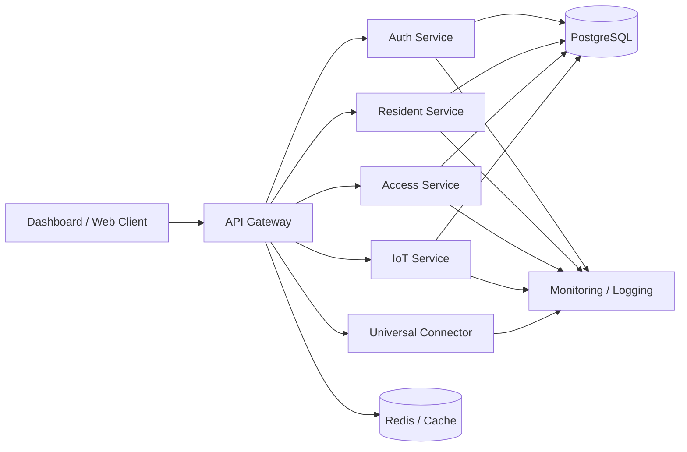
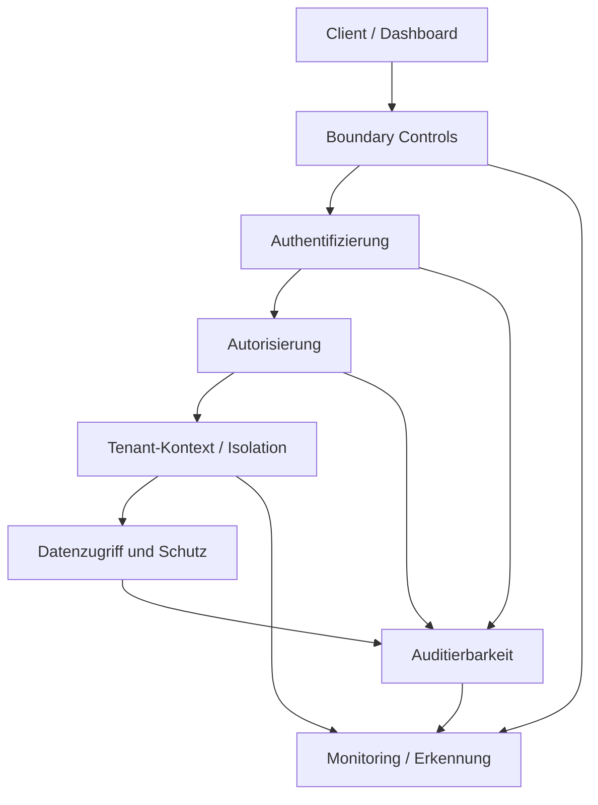

# TyrSec PaaS

Dieses Repository ist die öffentliche Dokumentationsfassung des Projekts **TyrSec PaaS**. Gezeigt werden Architektur, Sicherheitsansatz, Betriebsmodell und der funktionale Zuschnitt auf einer Ebene, die für fachliche Einordnung und technische Gespräche sinnvoll ist.

Der vollständige Quellcode, operative Detailkonfigurationen, interne Runbooks und sicherheitsrelevante Low-Level-Parameter verbleiben im privaten Implementierungs-Repository.

## Worum es in diesem Repository geht

TyrSec PaaS ist als modulare Plattform aufgebaut. Das System kombiniert ein webbasiertes Dashboard mit einem zentralen API-Gateway und mehreren fachlich getrennten Services. Ergänzt wird die Laufzeitumgebung durch Komponenten für Persistenz, Caching, Monitoring und externe Integrationen.

Der Showcase dient der technischen Einordnung. Er ist keine Installationsanleitung und keine vollständige Betriebsdokumentation.

## Architektur auf einen Blick

Die Plattform trennt fachliche Verantwortlichkeiten auf Service-Ebene. Zugriff, Mandantenkontext, Datenhaltung und Observability sind nicht als nachgelagerte Ergänzungen gedacht, sondern als durchgängige Querschnittsthemen.

## Sicherheitsmodell auf einen Blick

Der Sicherheitsansatz ist auf kontrollierten Zugriff, klare Verantwortungsgrenzen und nachvollziehbare Verarbeitung ausgelegt. Die öffentliche Dokumentation beschreibt diese Prinzipien absichtlich nur auf hoher Ebene.

## Kernbereiche

- webbasiertes Dashboard für Bedienung und Übersicht
- API-Gateway als zentraler Zugriffspunkt
- getrennte Services für Authentifizierung, Resident-, Access- und IoT-Funktionen
- Universal Connector für externe Integrationen und Provider-Anbindung
- Datenhaltung, Cache und unterstützende Laufzeitdienste
- Monitoring- und Logging-Bausteine für den Betriebsüberblick

## Sicherheitsansatz

Die privaten Projektdokumente beschreiben einen Zero-Trust-orientierten Sicherheitsrahmen mit getrennten Zuständigkeiten für Authentifizierung und Autorisierung, Mandantenkontext für den Datenzugriff, Secret-Handling außerhalb statischer Konfiguration und nachvollziehbarer Verarbeitung sicherheitsrelevanter Vorgänge.

Im Showcase werden diese Inhalte bewusst abstrahiert dargestellt. Nicht veröffentlicht werden konkrete Token-Schemata, Schwellenwerte, Guard-Kombinationen, interne Ausnahmelisten, Betriebsendpunkte oder Policy-Details.

## Deployment- und Betriebsmodell

Die Dokumentation beschreibt ein containerbasiertes Betriebsmodell mit Gateway, Fachservices, Datenhaltung und Observability-Komponenten. Umgebungen und Konfigurationskontexte sind getrennt geführt. Interne Betriebsabläufe und operative Detailpfade sind in diesem Repository absichtlich nicht enthalten.

## Weiterführende Dokumentation

- [Architektur](./docs/architecture.md)
- [Security Overview](./docs/security-overview.md)
- [Deployment Overview](./docs/deployment-overview.md)
- [Feature Summary](./docs/feature-summary.md)
- [Security Policy](./SECURITY.md)

## Abgrenzung

Dieses Repository ist ein redigierter technischer Showcase. Es zeigt die fachliche und architektonische Struktur des Projekts, aber nicht die vollständige Implementierung.

Der vollständige Quellcode, interne Betriebsartefakte, sensible Konfigurationsdetails und projektspezifische Runbooks bleiben privat.