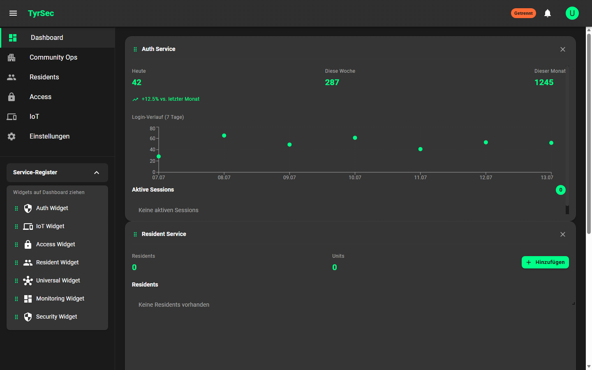

# Screenshots

## Dashboard-Übersicht

## Aufnahmekontext (Transparenz)

- Der Screenshot zeigt das reale Dashboard-Frontend des privaten Repositories
  (React 19, Material UI, Widget-Grid mit Drag-and-drop).
- Aufgenommen wurde der Standalone-Modus **ohne verbundenes Backend** — daher
  der Verbindungsstatus „Getrennt" oben rechts. Kennzahlen in den Widgets sind
  lokale Beispieldaten des Frontends, keine Produktionsdaten.
- Sichtbare Module: Dashboard, Community Ops, Residents, Access, IoT sowie das
  Service-Register mit den verfügbaren Widgets (Auth, IoT, Access, Resident,
  Universal Connector, Monitoring, Security).

Screenshots des vollständigen Stacks (Gateway + Services + Datenhaltung via
Docker Compose) enthalten Demo-Daten aus dem Community-Ops-Seed und werden nur
nach Redaktionsprüfung gemäß [EXPORT-CHECKLIST.md](../../EXPORT-CHECKLIST.md)
ergänzt.
